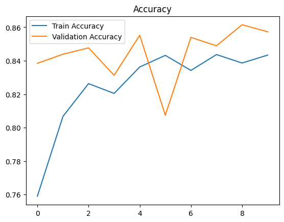
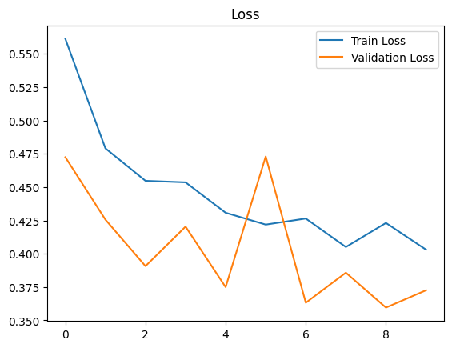
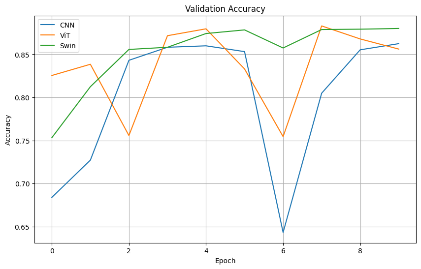

# Breast Cancer Classification Projects

This repository contains two Jupyter notebooks for breast cancer histopathology classification:

- `model1.ipynb`: A CNN-based classifier with train/validation/test splits.
- `model2.ipynb`: A comparison of CNN, Vision Transformer (ViT), and Swin Transformer models.

## Model 1: CNN Classifier

This notebook trains a convolutional neural network on the BreaKHis dataset, splitting data into **60% train**, **20% validation**, and **20% test**. It applies data augmentation and plots training/validation metrics.

### Key Features
- **Preprocessing**: Directory-based split using `train_test_split`.
- **Data Augmentation**: Horizontal flip, rotation, rescaling.
- **Model Architecture**: Three Conv2D+MaxPooling blocks, followed by dense layers.
- **Training**: 10 epochs with `accuracy` and `loss` metrics.
- **Evaluation**: Final performance on validation and test sets.

### Training Metrics

---

## Model 2: Model Comparisons

This notebook trains and compares three architectures:

1. **CNN**
2. **Vision Transformer (ViT)**
3. **Swin Transformer**

It uses the `image_dataset_from_directory` API with **16** batch size and **224×224** image size, normalizes inputs, and runs **10** epochs for each model.

### Architecture Summaries
- **CNN**: Standard sequential Conv2D blocks.
- **ViT**: Patch embedding + multi-head self-attention layers.
- **Swin**: Local windowed attention with shifting.

### Validation Accuracy Comparison

> This bar / line chart compares the validation accuracy of each model after 10 epochs.

---

## Results Summary

| Model     | Validation Accuracy | Test Accuracy (Model 1) |
| --------- | ------------------- | ----------------------- |
| CNN (M1)  | —                   | 84.70%                  |
| CNN (M2)  | \~86%               | —                       |
| ViT (M2)  | \~86%               | —                       |
| Swin (M2) | \~88%               | —                       |

---

*Prepared by Nitin Singh*
